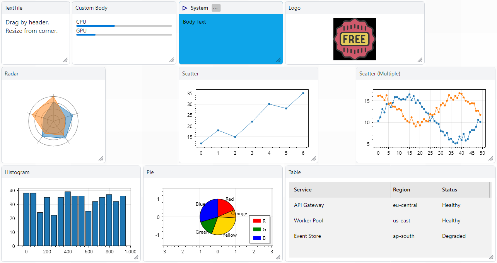

# MiniDashboard.Avalonia

[](https://www.nuget.org/packages/MiniDashboard.Avalonia)

**MiniDashboard.Avalonia** provides dashboard controls for **Avalonia 12** applications. Choose free tile placement in a fixed grid with `DashboardPanel`, or one tile per cell in a dynamically editable matrix with `DashboardMatrix`. Both hosts share the same tiles, content catalogs, and header styling.



*Classic dashboard demo: draggable, resizable tiles with shared headers, ScottPlot charts, and a service table.*

## Packages

- `MiniDashboard.Avalonia` - classic and matrix dashboard hosts, content catalogs, and tile controls.
- `MiniDashboard.Avalonia.ScottPlot` - optional ScottPlot chart tiles.
- `MiniDashboard.Avalonia.TreeDataGrid` - optional TreeDataGrid tiles.
- `MiniDashboard.Avalonia.TreeDataGridOS` - optional TreeDataGrid tiles backed by the community-maintained open-source fork.

The projects target `net10.0`, matching the recommended target for Avalonia 12.

## Features

- **DashboardPanel**: fixed `Rows` x `Columns` grid, attached layout properties, snap preview, and collision-aware move/resize resolution.
- **DashboardItemsPanel**: ItemsSource-based dashboard host that materializes generated tile controls directly as dashboard children.
- **DashboardMatrix**: dynamically insertable/removable global rows and columns, proportional native splitters, optional headers, touch-accessible boundary menus, and persistence-friendly snapshots.
- **DashboardContentTile**: catalog-selected content inside a classic tile; reuse the same catalog in a matrix.
- **Tile**: base content tile with grid position/size properties, custom header content, optional resize grip, styling properties, and placement-valid feedback.
- **TextTile**: simple text display tile.
- **ImageTile**: image display tile using `ImageSource` or `SourceUri`.
- **TableViewTile**: read-only tabular data display using Avalonia's `TableView` control.
- **ScottPlot tiles**: `PlotTile`, cartesian chart tiles, and pie chart tiles.
- **TreeDataGrid tiles**: `TreeDataGridTile` and `CsvGridTile`.

## Choosing a dashboard

| Host | Layout | Best suited to |
| --- | --- | --- |
| `DashboardPanel` | Free placement and tile spans within fixed rows/columns | Static XAML dashboards |
| `DashboardItemsPanel` | The same classic layout, populated from an items source | View-model-driven dashboards |
| `DashboardMatrix` | One tile per cell, with editable rows/columns and proportional sizing | Structured dashboards that users split and resize |

A matrix split inserts an entire row or column across the matrix. It does not create nested panes. See [Dynamic Matrix Dashboards](#dynamic-matrix-dashboards) for setup, editing, cancellation, and persistence, and [Shared content](#shared-content-across-both-dashboards) for using one catalog with both layouts.

## Install

Install the core package first:

```bash
dotnet add package MiniDashboard.Avalonia
```

Install optional extension packages only when needed:

```bash
dotnet add package MiniDashboard.Avalonia.ScottPlot
dotnet add package MiniDashboard.Avalonia.TreeDataGrid
dotnet add package MiniDashboard.Avalonia.TreeDataGridOS
```

`MiniDashboard.Avalonia.TreeDataGrid` depends on Avalonia's TreeDataGrid package. Avalonia 12 TreeDataGrid package usage may require an Avalonia UI license in consuming applications. `MiniDashboard.Avalonia.TreeDataGridOS` instead depends on the MIT-licensed community `TreeDataGrid.Avalonia` fork. The two packages are alternatives and should not be referenced together.

## Register Styles

Add the style include for each package you use in `App.axaml`:

```xml
<Application xmlns="https://github.com/avaloniaui"
             xmlns:dashboard="clr-namespace:MiniDashboard.Avalonia.Themes;assembly=MiniDashboard.Avalonia"
             xmlns:dashboardScottPlot="clr-namespace:MiniDashboard.Avalonia.ScottPlot.Themes;assembly=MiniDashboard.Avalonia.ScottPlot"
             xmlns:dashboardGrid="clr-namespace:MiniDashboard.Avalonia.TreeDataGrid.Themes;assembly=MiniDashboard.Avalonia.TreeDataGrid"
             xmlns:dashboardGridOS="clr-namespace:MiniDashboard.Avalonia.TreeDataGrid.Themes;assembly=MiniDashboard.Avalonia.TreeDataGridOS">
  <Application.Styles>
    <FluentTheme />
    <dashboard:MiniDashboardStyles />

    <!-- Optional extension styles -->
    <dashboardScottPlot:ScottPlotStyles />
    <dashboardGrid:TreeDataGridStyles />
    <!-- Use this instead of dashboardGrid:TreeDataGridStyles for the community fork. -->
    <!-- <dashboardGridOS:TreeDataGridStyles /> -->
  </Application.Styles>
</Application>
```

## Basic Usage

```xml
<dash:DashboardPanel xmlns:dash="clr-namespace:MiniDashboard.Avalonia;assembly=MiniDashboard.Avalonia"
                     Rows="6"
                     Columns="8">
  <dash:TextTile GridX="0" GridY="0" GridW="2" GridH="2"
                 TileHeader="Notes"
                 Text="Drag me" />

  <dash:Tile GridX="2" GridY="0" GridW="3" GridH="2"
             TileHeader="Status">
    <StackPanel>
      <TextBlock Text="CPU" />
      <ProgressBar Minimum="0" Maximum="100" Value="57" />
    </StackPanel>
  </dash:Tile>
</dash:DashboardPanel>
```

Drag a tile by its header. Resize it from the bottom-right grip when `IsResizable` is `true`.

## Layout Model

Tiles expose grid properties that are synchronized to the parent `DashboardPanel` attached properties:

- `GridX` and `GridY` define the top-left grid cell.
- `GridW` and `GridH` define the tile span in cells.
- `MinGridW` and `MinGridH` define resize minimums.

The panel resolves overlapping moves to a nearby free position and shrinks colliding resize requests to fit. Move previews show whether a valid destination is available; resize previews also indicate adjusted sizes. Use `LastPlacementFailureReason` when the host needs the reason for an adjustment.

## Dynamic ItemsSource Dashboards

Use `DashboardItemsPanel` for MVVM or config-driven dashboards. It derives from `DashboardPanel`, exposes `ItemsSource` and `ItemTemplate`, and uses the control's `DataTemplates` collection to build one direct dashboard child per item. It does not use `ContentPresenter` item containers, so generated `Tile` controls keep the same drag and resize behavior as static XAML children.

```xml
<dash:DashboardItemsPanel xmlns:dash="clr-namespace:MiniDashboard.Avalonia;assembly=MiniDashboard.Avalonia"
                          xmlns:vm="clr-namespace:MyApp.ViewModels"
                          xmlns:views="clr-namespace:MyApp.Views"
                          ItemsSource="{Binding Tiles}"
                          Rows="10"
                          Columns="15">
  <dash:DashboardItemsPanel.DataTemplates>
    <DataTemplate DataType="{x:Type vm:LogTileViewModel}">
      <views:LogTile />
    </DataTemplate>
    <DataTemplate DataType="{x:Type vm:MetricTileViewModel}">
      <views:MetricChartTile />
    </DataTemplate>
  </dash:DashboardItemsPanel.DataTemplates>
</dash:DashboardItemsPanel>
```

Each template-generated control receives the source item as its `DataContext`. If an item is already a `Control`, it is used directly without changing its data context or bindings. If no matching template can build a `Control`, `DashboardItemsPanel` throws a clear exception.

By default, generated `Tile` controls bind common layout conventions from the item view model:

- `TileHeaderPath="Title"`
- `GridXPath="X"`
- `GridYPath="Y"`
- `GridWPath="Width"`
- `GridHPath="Height"`
- `GridBindingMode="TwoWay"`

Set any path to `{x:Null}` to disable that convention binding. Set `DisposeRemovedTiles="True"` to dispose removed generated controls that implement `IDisposable`. `PreserveStaticChildren="True"` keeps any static children declared directly in the panel while generated children are rebuilt.

`DashboardPanel` remains the simplest choice for static XAML dashboards. `DashboardItemsPanel` is the recommended host when tiles come from view models, configuration files, or runtime collections.

## Data Binding And Persistence

Bind grid properties to view model fields to save and restore layouts:

```xml
<dash:TextTile GridX="{Binding X}"
               GridY="{Binding Y}"
               GridW="{Binding W}"
               GridH="{Binding H}" />
```

Recommended persistence shape:

1. Store one view model per tile with `Id`, `X`, `Y`, `W`, `H`, tile type, and payload.
2. At startup, deserialize the layout, create each tile, and apply the grid properties.
3. After user move/resize, persist the updated grid values from the bound view models.

## Custom Header Content

```xml
<dash:Tile GridX="0" GridY="0" GridW="3" GridH="2"
           TileBackground="#0ea5e9">
  <dash:Tile.HeaderContent>
    <StackPanel Orientation="Horizontal" Spacing="6">
      <Path Data="M2,2 L12,7 L2,12 Z"
            Width="14"
            Height="14"
            Stroke="DarkBlue"
            StrokeThickness="1.5" />
      <TextBlock Text="System" FontWeight="SemiBold" />
      <Button Content="..." Padding="2,0" MinWidth="24" />
    </StackPanel>
  </dash:Tile.HeaderContent>

  <TextBlock Text="Body text" />
</dash:Tile>
```

Interactive controls in the header, such as buttons and text inputs, do not start tile dragging.

## ScottPlot Extension

Register `ScottPlotStyles`, then use chart tiles inside a dashboard:

```xml
<cartesian:ScatterPlotTile xmlns:cartesian="clr-namespace:MiniDashboard.Avalonia.ScottPlot.Cartesian;assembly=MiniDashboard.Avalonia.ScottPlot"
                           GridX="0" GridY="0" GridW="5" GridH="3"
                           TileHeader="Scatter"
                           Ys="{Binding SimpleSeries}" />
```

Available chart types include `ScatterPlotTile`, `SignalPlotTile`, `HistogramPlotTile`, `BarsPlotTile`, `FinancialPlotTile`, and `PiePlotTile`.

## TableView Tile

`TableViewTile` is a lightweight read-only table backed by Avalonia 12.1's `TableView`. Define native `TableViewColumn` instances for bindings, templates, widths, alignment, and optional per-column resize behavior:

```xml
<dash:TableViewTile xmlns:dash="clr-namespace:MiniDashboard.Avalonia;assembly=MiniDashboard.Avalonia"
                    GridX="0" GridY="0" GridW="5" GridH="3"
                    TileHeader="Services"
                    ItemsSource="{Binding Services}">
  <dash:TableViewTile.Columns>
    <TableViewColumn Header="Name" Binding="{Binding Name}" Width="2*" />
    <TableViewColumn Header="Status" Binding="{Binding Status}" Width="*" />
  </dash:TableViewTile.Columns>
</dash:TableViewTile>
```

Set `CanUserResizeColumns="False"` on the tile to disable resizing for all columns, or set `TableViewColumn.CanUserResize` on an individual column.

## TreeDataGrid Extension

Register `TreeDataGridStyles`, then bind a `TreeDataGridSource` to `TreeDataGridTile.Source`:

```xml
<data:TreeDataGridTile xmlns:data="clr-namespace:MiniDashboard.Avalonia.TreeDataGrid;assembly=MiniDashboard.Avalonia.TreeDataGrid"
                       GridX="2" GridY="0" GridW="5" GridH="4"
                       TileHeader="People"
                       Source="{Binding PeopleGridSource}" />
```

`CsvGridTile` can load a simple comma-separated file path. It intentionally uses a minimal CSV parser and does not support quoting or escaping.

For the community package, use the same CLR namespace with the OS assembly name and register `dashboardGridOs:TreeDataGridStyles` instead. Its `TreeDataGridTile` accepts the fork's `ITreeDataGridSource`; `CsvGridTile` continues to work without API changes.

## Extending

To create a custom tile:

1. Derive from `Tile`, or from an extension base such as `CartesianPlotTile`.
2. Register Avalonia styled properties with `AvaloniaProperty.Register`.
3. Provide a control theme or template under your application's styles.
4. Bind template parts to the tile properties.

If a derived tile should reuse a base tile's existing control theme, override `StyleKeyOverride`:

```csharp
public class LogTile : TableViewTile
{
  protected override Type StyleKeyOverride => typeof(TableViewTile);
}
```

Dashboard child styles use `:is(...)` selectors so derived tile classes still receive the dashboard-level corner radius, border brush, and border thickness bindings.

Example:

```csharp
using System;
using Avalonia;
using MiniDashboard.Avalonia;

public class ClockTile : Tile
{
    public static readonly StyledProperty<DateTime> NowProperty =
        AvaloniaProperty.Register<ClockTile, DateTime>(nameof(Now), DateTime.Now);

    public DateTime Now
    {
        get => GetValue(NowProperty);
        set => SetValue(NowProperty, value);
    }
}
```

## Dynamic Matrix Dashboards

Use `DashboardMatrix` for one content slot per cell in a dynamically editable matrix. `DashboardPanel` and `DashboardItemsPanel` still provide free tile placement and spans inside a fixed discrete grid. Both dashboards host the same `Tile` controls and themes. The matrix remains a separate layout control: no pane trees, docking, floating windows, or custom layout engine.

Register `MiniDashboardStyles` as shown above, then place the matrix in a container that gives it a finite width and height:

```xml
<dash:DashboardMatrix x:Name="Matrix"
                      MinCellWidth="96" MinCellHeight="72"
                      SplitterThickness="1" SplitterHitThickness="8" CellSpacing="6"
                      DisposeRemovedContent="True" />
```

Supply a catalog of fresh-control factories. IDs are stable, case-sensitive persistence keys; titles are display text and may be localized.

```csharp
Matrix.ContentDefinitions = new DashboardContentDefinition[]
{
    new()
    {
        Id = "notes",
        Title = "Notes",
        Factory = () => new TextBox { AcceptsReturn = true }
    },
    new()
    {
        Id = "status",
        Title = "Status",
        Factory = () => new TextBlock { Text = "Healthy" }
    }
};

Matrix.SetContent(Matrix.Layout.Cells[0].Id, "notes");
Matrix.InsertColumnAfter(0); // 1 × 2: splits column zero's weight in half
Matrix.InsertRowAfter(0);    // 2 × 2: inserts across every column
```

Use `InsertRowBefore/After`, `InsertColumnBefore/After`, `RemoveRow`, and `RemoveColumn` with zero-based logical indices. Insertion divides the referenced definition's current weight equally and inserts empty cells. Removal transfers its weight to the preceding definition, or the following one at index zero. At least one row and column must remain. Existing cell IDs survive coordinate changes.

Tiles in both dashboards use a common compact `DashboardHeader`. Body-content tiles show the selected catalog title, or “Empty”; complete tiles keep their own title and custom header. Set `IsHeaderVisible="False"` on the matrix to omit its headers. The trailing action button appears on hover or keyboard focus; its 28 DIP target remains available to touch at rest. With matrix headers hidden, actions appear temporarily over a boundary when it is hovered, tapped, or keyboard-focused. Hidden buttons never intercept tile content. Empty cells still offer the centered **Add content** button. Hosted controls keep their own context menus.

Splitters use native Avalonia pointer and keyboard resizing. Tab to a divider and use arrow keys. Their transparent hit area overlaps a narrow strip of adjacent cell edges. Defaults are a 1 DIP visual divider, 8 DIP hit target, and 6 DIP `CellSpacing`, with 6 DIP outer `Padding`. The gap reserves the larger of `CellSpacing` and `SplitterThickness`. At divider intersections, the row divider takes pointer priority; the column divider remains reachable along either adjoining segment or through keyboard focus. Set `CanResize="False"` to disable splitter input, and `CanModifyStructure="False"` to disable insertion/removal through both menus and structural methods. Content editing remains available. Minimum cell sizes are maintained; on small screens, provide scrolling or a suitably small layout.

### Host confirmation and persistence

All mutations run on the Avalonia UI thread. `LayoutChanging` supplies the operation kind, previous/proposed immutable snapshots, and affected previous assignments. Set `Cancel = true` to veto. This includes removal, replacement, clearing, restoration, and changes to proportions. For asynchronous confirmation, cancel synchronously, ask in the host UI, then retry the operation after validating that the target still exists. Do not mutate the matrix inside a change handler.

```csharp
Matrix.LayoutChanging += (_, e) =>
{
    if (e.Kind is DashboardMatrixChangeKind.RemoveRow or DashboardMatrixChangeKind.RemoveColumn
        && e.AffectedCells.Any(cell => cell.ContentId is not null))
    {
        e.Cancel = true; // Replace with the host application's confirmation policy.
    }
};
Matrix.LayoutChanged += (_, e) =>
{
    var json = System.Text.Json.JsonSerializer.Serialize(e.After);
    // Persist json using the application's storage policy.
};
```

Without a veto handler, requested removal is accepted. Operations return `false` when cancelled, disabled, or a no-op; invalid indices/layouts and factory failures throw. `LayoutChanged` runs after a committed operation; its cancellation value is ignored. Proportion notifications are coalesced on the UI dispatcher. A veto or exception before a proportion change commits restores the native splitter weights. Exceptions from post-commit notifications do not undo the committed layout. Change handlers must not modify the same host synchronously; schedule follow-up edits through the UI dispatcher. Flush any pending native splitter changes before saving:

```csharp
var json = System.Text.Json.JsonSerializer.Serialize(Matrix.GetSnapshot());
var saved = System.Text.Json.JsonSerializer.Deserialize<DashboardMatrixLayout>(json)!;
Matrix.RestoreLayout(saved);
```

Snapshots contain row/column star weights and cell IDs, coordinates, and content IDs. They never contain controls or factories. Weights need not sum to one. Snapshot methods such as `InsertRowAfter` and `WithContent` return new snapshots; apply them with `RestoreLayout`. Restoring is an explicit host operation and is available even when interactive structural editing is disabled. Content-specific control state is not serialized in v1.

### Content ownership

Each factory must return a fresh, unparented control. Existing assignments retain their instances across structural edits and resizing. Unknown IDs show an unavailable placeholder while retaining the ID. Replacing the catalog or changing an attached observable catalog reconciles content; `RefreshContent()` handles changes in ordinary collections. Observable catalog changes made while detached reconcile when reattached. Ordinary enumerable catalogs are materialized once per assignment or explicit refresh. A replaced definition recreates its matching instances. Factory failure keeps the previous assignments and live controls; the menu displays an error and public APIs throw.

`ClearContent(cellId)` clears an assignment. `MoveContent(sourceId, targetId)` requires an empty target, except that moving a cell to itself is a no-op; `SwapContent(firstId, secondId)` swaps occupied or empty assignments. Both preserve the complete tile and its content instance. The tile menu also offers **Move / swap tile** with row/column targets. Matrix tiles cannot span cells or resize individually; native splitters resize whole rows/columns.

`DisposeRemovedContent` defaults to false, matching the opt-in policy of `DashboardItemsPanel`. When enabled, discarded generated `IDisposable` controls are disposed on replacement, clearing, removal, catalog reconciliation, or explicit matrix disposal. Newly generated controls from an unsuccessful transaction are also released under this policy. Disposal failures are aggregated after all discarded controls receive a disposal attempt; an already committed layout remains applied.

Visual detachment (for example, switching tabs) preserves hosted instances and unsubscribes from the catalog. Call `DashboardMatrix.Dispose()` when permanently retiring a matrix that owns resources; it is idempotent. Reattaching a disposed matrix does not reactivate it.

See the demo's **Matrix** tab for a 2 × 3 example with editable notes, a scrollable event list, host-controlled removal protection, swap, and JSON snapshot save/restore.

## Shared content across both dashboards

`DashboardContentTile : Tile` brings the same catalog and selection menu to the classic dashboard. Layout behavior stays separate: tiles retain X/Y/W/H placement, while matrix cells use global rows and columns. Both use the same indexed catalog, content factory validation, picker, lifecycle policy, and change events.

```csharp
var catalog = DashboardContentCatalog.FromItems(
    widgets, widget => widget.Id, widget => widget.Title,
    widget => CreateWidgetControl(widget));

var tile = new DashboardContentTile
{
    ContentDefinitions = catalog,
    ContentId = widgets[0].Id,
    DisposeRemovedContent = true
};
dashboard.Children.Add(tile);
matrix.ContentDefinitions = catalog;
```

`DashboardContentCatalog` is observable and rejects duplicate IDs before mutation. Each selection creates an independent control. `ContentChanging` can veto changes, `ContentChanged` reports committed assignments, and `ContentFailed` reports factory failures. `ContentId` on `DashboardContentTile` supports two-way binding. Use `SetContent(id)` or `SetContent(null)` to select or clear its body.

Use `FromTemplate(items, idSelector, titleSelector, dataTemplate)` to adapt an existing item template. Use `FromTiles(items, idSelector, titleSelector, tileFactory)` to adapt classic tile recipes: it creates fresh complete tiles, preserving their header, custom template, and settings. Existing live tiles cannot be cloned or shared between parents; provide a factory or template for the underlying tile models. The **Same tiles, two layouts** demo tab shows the same catalog in both dashboard types.

Both generated-content hosts retain content during temporary visual detachment. Call `Dispose()` when permanently retiring a host, and opt into disposal of generated controls with `DisposeRemovedContent` or `DisposeRemovedTiles`. `DashboardItemsPanel` preserves generated instances on move/reset when the same item references remain; replacing its template regenerates template-created views. Direct `Control` items are borrowed: their DataContext and lifetime remain owned by the application.

Classic drag/resize commits now update bindable tile coordinates through `DashboardPanel.TrySetPlacement`. Hosts can veto through `PlacementChanging` or persist accepted changes through `PlacementChanged`. Only direct dashboard tiles participate; nested tile content cannot drag or resize its outer dashboard.

Shared tile templates preserve custom `HeaderContent` / `HeaderTemplate`, optional `HeaderActions`, and invalid-placement feedback. Resize grip chrome is shared across the core, chart, and tree-grid tile themes. Matrix menu text can be overridden with resources such as `DashboardAddContent`, `DashboardChangeContent`, `DashboardClearContent`, and `DashboardInsertRowAbove`.

### Common chrome resources

Both dashboard types share corner radii, body padding, header metrics, and action button styling. Override these resources at application or container scope:

```xml
<CornerRadius x:Key="DashboardCellCornerRadius">6</CornerRadius>
<Thickness x:Key="DashboardContentPadding">10</Thickness>
<x:Double x:Key="DashboardHeaderMinHeight">32</x:Double>
<x:Double x:Key="DashboardActionSize">28</x:Double>
```

Increase the action size for touch-heavy applications. Action targets remain hit-testable before hover and stay visible while their flyout is open. Plain header titles use ellipsis when space is tight and expose the full title in a tooltip; custom header content and templates retain their own presentation.

The shared action and empty-cell labels can be localized through `DashboardContentActionsLabel` and `DashboardAddContentLabel`. Set `DashboardEmpty` for the empty-cell title before creating content; menu strings are resolved when menus are built.

### Complete tiles and content bodies

Every matrix slot hosts a `Tile` directly. There is no separate matrix-cell visual template. Use exactly one factory on each `DashboardContentDefinition`:

- `Factory` creates a content body. The matrix supplies a `DashboardContentTile`.
- `TileFactory` creates a complete tile (text, chart, tree grid, or custom tile). The matrix hosts it directly, without a wrapping or nested tile.

```csharp
var catalog = new DashboardContentCatalog
{
    new() { Id = "notes", Title = "Notes",
        Factory = () => new TextBox { AcceptsReturn = true } },
    new() { Id = "status", Title = "Status tile",
        TileFactory = () => new TextTile { TileHeader = "Status", Text = "Healthy" } }
};
matrix.ContentDefinitions = catalog;
matrix.SetContent(matrix.Layout.Cells[0].Id, "status");

// The same catalog creates a native tile for the classic dashboard.
classic.Children.Add(catalog.CreateTile("status"));
classic.Children.Add(catalog.CreateTile("notes"));
```

A standalone `DashboardContentTile` selects body definitions; complete tiles belong directly in their dashboard. `FromTiles` produces `TileFactory` entries. `FromTemplate` is for body templates; use `FromTiles` when the template builds tiles.

Matrix header visibility and resize suppression are host overrides. They do not overwrite the tile's `IsHeaderVisible`, `IsResizable`, spans, or `HeaderActions`. Built-in templates use `IsHeaderPresented`, `IsResizeGripVisible`, and `EffectiveHeaderActions`; custom tile templates should bind those effective properties as well. Matrix structural actions and movement are available through the shared header (or the adjacent boundary menu when hidden), with existing custom actions under **Tile actions**. Classic resize handling lives in a separate interaction behavior.

`GetTile(cellId)` returns the current live tile after the matrix template is applied. Use matrix assignment APIs for selection and removal so persistence, cancellation, and disposal remain consistent. Controls and tiles never become part of the saved layout; their stable catalog IDs remain the persisted assignments.

### Boundary and tile spacing

Matrix splitters are invisible at rest and appear when the pointer is over a boundary or when the splitter has keyboard focus. Their hit targets stay active for touch and pointer resizing. The classic dashboard now defaults to a 3 DIP `TileMargin` on each edge, producing the same 6 DIP gap as the matrix's `CellSpacing`. Explicit application margins and spacing still take precedence. The reserved matrix gap is `max(CellSpacing, SplitterThickness)`; `SplitterHitThickness` can overlap adjacent cell edges without enlarging that gap. Minimum cell sizes can make a large matrix exceed its available space, so limit its dimensions or place it in a suitable scrolling container.

The **Same tiles, two layouts** demo demonstrates one catalog supplying both layout types, independent content instances, and new catalog entries appearing in both content menus. Its labels explain the different movement and resizing controls.

### Headerless boundary menus

With `IsHeaderVisible="False"`, each internal boundary segment and outer edge has a subtle, focusable action button. It opens **Insert row here** / **Insert column here** and **Cell above/below** or **Cell left/right** submenus for that segment. Cell menus offer content selection, clearing, moving/swapping, custom tile actions, and row/column removal through the existing cancellable host hooks. Outer-edge actions keep a 1×1 matrix fully editable. Resizing and structural-edit capability flags remain independent of content editing.

The rest of each native splitter remains draggable. Hover a boundary to reveal its menu button, then move onto the button to open it. It stays visible while its menu is open and hides after interaction ends. On touch, tap a boundary to reveal the button, then tap the button; dragging the boundary still resizes. Tap elsewhere to dismiss a revealed button. Keyboard focus also reveals boundary actions.

Buttons temporarily overlap adjacent tile edges. When hidden, they are not hit-testable. `BoundaryActionSize` controls only the overlay size (24 DIP by default, minimum 16); it does not reserve space. Both header modes retain the configured `CellSpacing` and `Padding` (6 DIP defaults), including the outer perimeter. Toggling headers preserves tile instances, assignments, and row/column weights.

## License

MIT. See [LICENSE.txt](LICENSE.txt).
